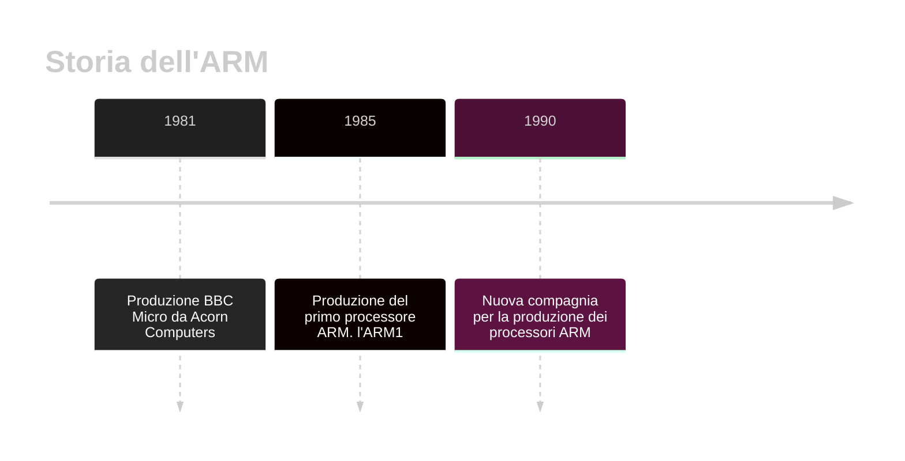

- - -
*Esempio specifico-pratico di architettura Von-Neumann: ARM. Notizie storiche, introduzione generale, struttura di ARM-v7a, concetto di registri.*
- - -
# 1. Introduzione Generale
**UN ESEMPIO PRATICO.** Finora abbiamo solo visto *strutture generali di architetture*: abbiamo capito come un *calcolatore* legge un *programma*, e una struttura *particolare* di un tale calcolatore. Adesso vediamo un esempio *pratico* di *un'architettura*: l'ARM, presente ancora oggi nei nostri dispositivi, tra cui cellulari, tablet, portatili, ...
**NOTIZIE STORICHE.** Il primo *processore* dell'*architettura ARM* venne prodotto nel *1985*, dalla *Acorn Computers*, una società britannica. Dopodiché la progettazione dei *processori* venne delegata ad una diversa compagnia, nel *1990*. Attualmente l'*ARM* non produce più i processori, ma li progetta e si limita a *distribuire i diritti di proprietà intellettuale*. Nel corso della storia, il significato di *ARM* è passado a *"Advanced Risc Machine"*. Ma che vuol dire *"Risc"*? Lo vedremo con i *paradigmi CISC-RISC* delle istruzioni ([[Paradigmi CISC e RISC]]).

**FIGURA 1.1.** (*Linea temporale*)

# 2. Struttura di Arm-V7a
**Arm-v7a.** Ora vediamo una *versione specifica* dell'ARM. In questa versione dell'*ARM* abbiamo *tredici registri* per l'*uso generale*, ognuno dotato di *32 bit* (ovvero *4 byte*).
Dopodiché ci sono altri *quattro registri specifici*, tra cui *due* sono usati per *lo stack delle chiamate*, uno per il *program counter* e uno per il *program status register*.

**FIGURA 2.1.** (*Arm-v7a*)
![[Pasted image 20240311175623.png]]