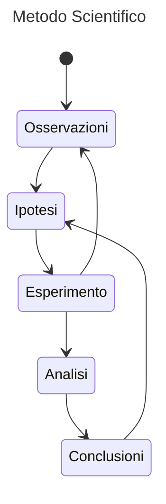

- - -
*Breve introduzione alla Fisica: il significato di studiare fisica, l'organizzazione dei concetti relativi alla fisica e il metodo scientifico.*
- - -
# 1. Il significato della Fisica
La *Fisica* (dal greco **φύσις**, ovvero **natura**) è lo studio *fondamentale* della *materia*.
In particolare la fisica *classica* (o *meccanica classica*) è quella branca della fisica che studia la i *movimenti dei corpi puntiformi*, la *dinamica del corpo*, la *termodinamica* e i fenomeni dell'*elettromagnetismo*. Storicamente la fisica classica è stata riformulata molte volte negli ultimi secoli, dando una fondazione molto precisa a questa branca.
Tuttavia questa precisione potrebbe trarci inganno, dal momento che nella *fisica* si tratta di un ciclo continuo tra formulazioni delle ipotesi, confutazioni, ulteriori sviluppi e altre ipotesi.
Infatti, questo avviene con la *fisica moderna*, che studia la *relatività* e la fisica *quantistica*: ancora oggi vi è un *divario* tra questi due ambiti fisici.
# 2. Organizzazione della Fisica
I contenuti relativi alla *Fisica* vengono organizzati secondo le seguenti categorie.
*Principi.* Per *"principio fisico"* intendiamo una *proposizione generale* (o *universale*) che vale sempre.
*Legge.* Per *"legge"* si intende una *relazione matematica* tra due o più *grandezze fisiche*; sostanzialmente è un modo per *descrivere* i *principi*.
*Modello.* Per *"modello fisico"* si intende un'analogia, una rappresentazione semplificata del nostro mondo complesso.
*Teoria.* Quando mettiamo assieme delle *leggi*, dei *principi* e un *modello* senza creare contraddizioni, si ha una *teoria*.
# 3. Il Metodo Scientifico
Si presenta prima un diagramma che illustra il c.d. *metodo scientifico*, poi per analizzare alcune parti.

Evidenziamo il passaggio più saliente di questo grafico: la *verifica delle ipotesi con degli esperimenti*.
E' fondamentale che le *ipotesi* vanno *verificate* con degli esperimenti. Una *non-definizione* del metodo scientifico è proprio quella presunzione che una *ipotesi* (o *teoria*) sia *inconfutabile*; il filosofo della scienza K. Popper (https://it.wikipedia.org/wiki/Karl_Popper) conia il termine *"falsificabile"* per esprimere il fatto che una teoria  può essere sempre *confutata* con un'*esperimento*.