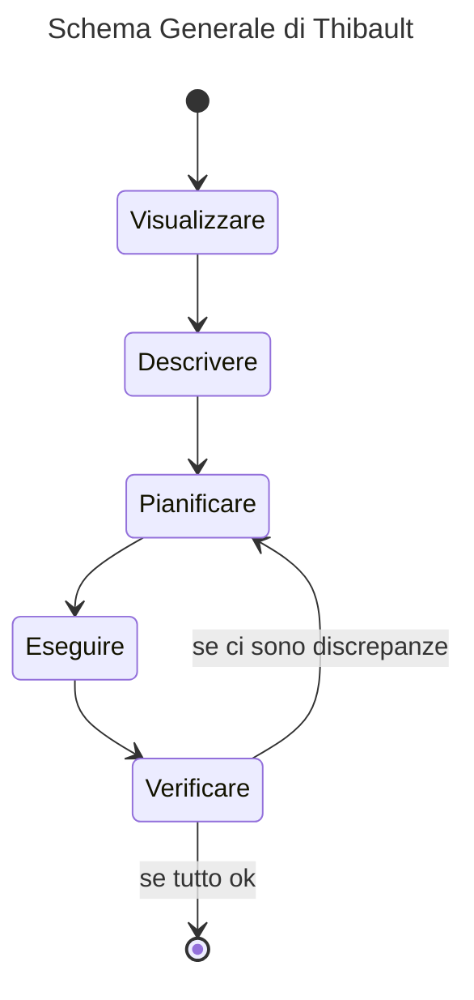

- - -
*Consigli del prof. Pierre Thibault per affrontare e risolvere problemi di Fisica.*
- - -
# 1. I passi per risolvere i problemi di Fisica
Per risolvere i *problemi di fisica*, è opportuno seguire i sei passi.
1. *Visualizzare.* In questa fase è importante *solamente* visualizzare il problema; quindi si fanno disegni, diagrammi rappresentativi; si riformula la domanda per conformare la visualizzazione di questo problema. Si fa un'idea mentale del problema, tutto sommato.
2. *Descrivere.* Questo è un proseguimento della prima fase, in cui creo dei *diagrammi* più precisi (come ad esempio i *diagrammi di corpo libero*), scegliendo *opportunamente* i *sistemi di riferimento/coordinate*.
3. *Pianificare.* Adesso posso iniziare ad usare il *linguaggio matematico*; scrivo le *equazioni generali*, poi per effettuare delle *sostituzioni simboliche* opportune.
4. *Eseguire.* In questa (quasi) ultima fase basta eseguire i calcoli con la calcolatrice.
5. *Verificare.* Prima di concludere e chiudere definitivamente il problema, bisogna ragionare sul *risultato*. Il risultato ha senso o no? Le misure sono giuste? Insomma, poniamo una serie di domande confermative. Se trovo delle discrepanze nel risultato, ricominciare con la *fase 3.* (*pianificare*)

